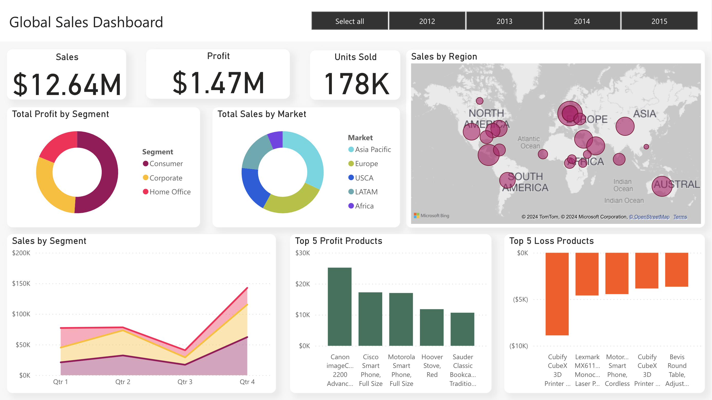

https://youtu.be/mnmJ9C5DoTE

# Power BI Sales Dashboard

This project delves into the analysis of sales data from a global superstore, leveraging Power BI to create a dashboard including insightful, interactive visualizations. From examining regional sales trends to identifying the top and bottom profit products, this analysis provides valuable insights into the store's operations.

[Click here to watch a video overview of the dashboard.](https://youtu.be/mnmJ9C5DoTE)

